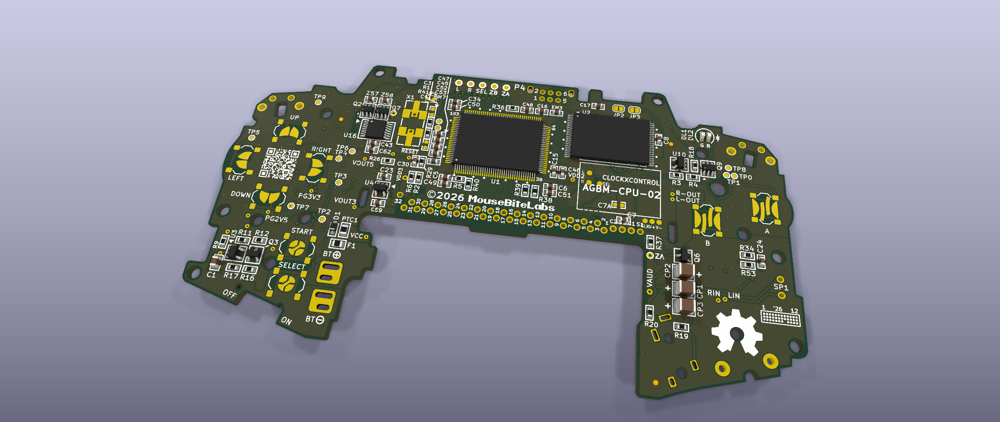
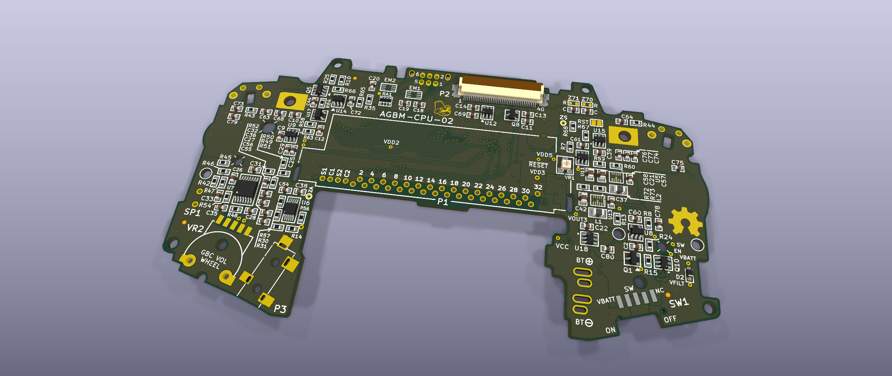

MouseBiteLabs' AGBM-02 carrying this fork's ClockxControl land pattern, front and back — raytraced by KiCad from
the board in [`clockxcontrol-integration/board/`](clockxcontrol-integration/board/), with every part the assembly line
places plus the hand-soldered set. The `CLOCKXCONTROL` outline below the RAM on the front is the module window; `P2`
on the back is the FFC display connector whose lands MouseBiteLabs narrowed in his August revision. Regenerated by
[`scripts/render_assembled.py`](scripts/render_assembled.py) and gated by check [15].

> ### This fork
>
> A desalvage fork of MouseBiteLabs' **Game Boy Enhance**. Upstream's README follows
> unchanged below; everything this fork adds lives in three directories.
>
> | | |
> |---|---|
> | [`clockxcontrol-integration/`](clockxcontrol-integration/) | a host-side footprint for insideGadgets' GBA ClockxControl, cut into the board: the land pattern, the crystal DNP build option, the `C7` relocation and the clock jumper. [`DESIGN-DECISIONS.md`](clockxcontrol-integration/DESIGN-DECISIONS.md) is why it is the way it is |
> | [`pcbway-assembly/`](pcbway-assembly/) | preparing the board for PCBWay's assembly service — BOM resolution, sourcing audit, the consign/hand-solder split |
> | [`scripts/`](scripts/) | the board is a **function** of committed inputs, and the documents are **gated** against it |
>
> **Upstream:** synced to `MouseBiteLabs/Game-Boy-Enhance` @ `897a2ba` (2026-08-20), which
> includes his August revision narrowing the FFC connector lands. Every design file in this
> fork is **byte-identical to upstream's current state** — this fork's board is generated by
> splicing its own copper into his, so adopting a revision means refreshing his zip and
> rebuilding, never hand-editing. The root `.gitignore` is upstream's and is deliberately
> left untouched so future syncs never conflict; this fork's own ignore patterns live in
> scoped `.gitignore` files beside what they cover.
>
> ### What else changed, besides the module
>
> **Six fiducials, three per side.** MouseBiteLabs ships none — he hand-builds, and a hand
> builder does not need optical registration. A pick-and-place does, and the whole point of
> the assembly split is that a machine builds most of this board. They are deliberately
> **not paired** front-to-back, and each triangle is scalene so a machine cannot register the
> panel 180° out. Every site clears five things at once — the board outline *including its 13
> shell holes and the routed openings inside `SW1` and `VR2`*, the 64 keepout zones, other
> soldermask apertures as filled regions, hard copper on the mark's own layer, and courtyards
> — and check [13] re-measures all six on every run, failing if a margin moves by 5 µm.
>
> **Eleven value changes and two corrected descriptions, to buy back some of what the module
> costs.** The ClockxControl draws
> ~12 mA of its own whether or not you overclock, so fitting it costs about **45 mW at the
> battery before it speeds anything up**. The swaps are the other side of that ledger — an
> op-amp off a rail it was never specified for, an LED and its ballast, a PPTC off a hold
> current it sat under, and six resistors in the quiescent network:
>
> | | idle | in use, stock speed | in use, 1.75× |
> |---|---|---|---|
> | What the swaps hand back | **21.8 mW** | **25.9 mW** | **29.0 mW** |
> | …as a fraction of the whole | 12.8 % | 3.3 % | 3.0 % |
>
> `U7` alone (TLV9364 → TLV9064IPWR) is 12.0 mW of that. Separately, the post-brownout
> latched-off drain falls **6.90 mW → 0.98 mW**, a 7.1× cut in what a flat pack loses while
> the console sits switched on but latched off.
>
> **So how visible is the fork?** It depends entirely on where you measure:
>
> * **Playing, at stock speed** — the module costs ~45 mW and the swaps hand back ~26 mW.
>   Net **≈ +19 mW on a 792 mW operating point: about 2 %.** Effectively invisible.
> * **Idle** — the same 12 mA is now 26 % of a 170 mW idle figure, and the swaps only reach
>   21.8 mW of it. Net **≈ +22 mW on 170 mW: about 13 %.** Visible.
> * **Overclocked at 1.75×** — the module and the overclock together are **+159 mW**, and the
>   swaps recover 29 mW. The overclock costs about 79 minutes of runtime on a 6.26 Wh pack;
>   this hands back about 12 of them. **The energy cannot be won back**, and nothing here
>   pretends otherwise — the swaps make the *stock* build free and take the edge off the
>   overclocked one.
>
> Every figure above is **modelled**, referred to the battery, and anchored on MouseBiteLabs'
> own published measurements (170 mW idle, 792 mW representative use, 951 mW with the module
> at 1.75×, 2.4 V pack). **Nothing here was measured on a built board of this fork** — no such
> board exists yet. The per-part derivation is in
> [`DESIGN-DECISIONS.md`](clockxcontrol-integration/DESIGN-DECISIONS.md) §7.
>
> **Against MouseBiteLabs' own DRC rules this fork adds exactly one violation** — a
> deliberate courtyard overlap where the stock `C7` land is kept, DNP, inside the module
> window — and **zero unconnected pads**. `scripts/check_consistency.py` holds every document
> here to what the board actually is, and `scripts/check_drc.py` diffs KiCad's own DRC
> against his board by violation position.
>
> **Do not plot Gerbers from the committed board.** Its zone fill is MouseBiteLabs' own, from
> before this fork added copper, and stays stale on purpose so "we did not re-pour" is
> checkable. Open it in KiCad, *Fill All Zones*, then plot.

---

# Game Boy Enhance (AGBM)

The Game Boy Advance was the very first system I ever purchased with my own money way back in 2002. It has a special place in my heart! Now, after spending so much time doing Game Boy Color projects over the past few years, I decided to get to work on the GBA to see what I could do with it to modernize and improve it a bit. Luckily, I was able to complete this by the 25th anniversary of the GBA's release in North America to celebrate!

There's not a whole lot that needs to be "fixed" with modded GBAs - you can get away with a pretty great modern system by simply throwing in a screen kit on an original console. But as you probably well know, there are a *ton* of really damaged and crusty systems out there that are doomed for landfills (or for the closets of sickos like me). So at least for that reason, this fully open source GBA recreation only requires the original CPU and RAM - every single other part is **brand new** or has easily-sourced replacements available.

Other than that, you might be asking yourself - what separates this from a regular modded system, or one of those fancy Funnyplaying GBA boards? Well, here's a quick run-down:
- The audio on the AGBM is crystal clear, not dependent on whatever screen kit is being used, and has **stereo** output on the headphone jack (unlike the FP GBA) - <a href="https://github.com/MouseBiteLabs/Game-Boy-Enhance/wiki/Audio-Recordings">listen to the audio samples in the Wiki</a>
- The AGBM draws ~150mW less than the FP GBA (even with the fancy LEDs off) depending on the AGBM model - this equates to anywhere between 1 to 4 hours **more** playtime depending on the power draw based on your settings (like brightness level) - <a href="https://github.com/MouseBiteLabs/Game-Boy-Enhance/wiki/Power-Draw-and-Battery-Curves">check out the battery curves page in the Wiki</a>
- The AGBM is *also* more efficient than using an original GBA board with a screen kit installed in almost all situations (again, see the Wiki for more info)
- Other than the CPU and RAM, the AGBM uses **all brand-new components** - even the power switch and audio jack
  - The AGBM-02 has space for a new RAM chip, if your old one is damaged or missing!
- The AGBM has offerings for powering through AA batteries (AGBM-0X models), or native LiPo support (AGBM-1X models)
- The AGBM includes some user-configurable hotkey features, like a soft reset button combination, or for replacing touch controls on screen kits
- The AGBM has built-in tactile switch support if you like the SP-style clicky buttons
- The power LED now flashes when the battery is within minutes of dying, like the SP did
- The original locations of button test points have been retained on the AGBM for easy compatibility with existing mods, like Nataliethenerd's ARC GBA or insideGadgets' ClockxControl - <a href="https://github.com/MouseBiteLabs/Game-Boy-Enhance/wiki/Mod-Compatibility">see this page on the Wiki for mod compatibility</a>

This project is a labor of love, built on the backs of the greats (noted in the Acknowledgements below). I have made it **fully open source** with all the design files available and even included some <a href="https://github.com/MouseBiteLabs/Game-Boy-Enhance/wiki/Schematic-Explanation">technical explanations</a> to spread the love across the retro gaming community.

**If you find any errors or inconsistencies in this repository, let me know and you'll receive one (1) internet point.**

## Board Variants

Here's a quick table summarizing the differences between the board numbers. Boards that are numbered with 0X use AA batteries, and those with 1X use lithium-ion batteries.

| Board Number                                                                                           | Battery Type | Main Converter | Typical Battery Life | Donor RAM Required? |
| ------------------------------------------------------------------------------------------------------ | ------------ | -------------- | -------------------- | ------------------- |
| [AGBM-CPU-01](https://github.com/MouseBiteLabs/Game-Boy-Enhance/tree/main/AGBM-01%20(AA%20Batteries))  | AA           | LTC3527        | 5h20m to 15h30m      | Yes                 |
| [AGBM-CPU-02](https://github.com/MouseBiteLabs/Game-Boy-Enhance/tree/main/AGBM-02%20(AA%20Batteries))  | AA           | TPS63802       | 5h20m to 15h30m      | No                  |
| [AGBM-CPU-11](https://github.com/MouseBiteLabs/Game-Boy-Enhance/tree/main/AGBM-11%20(Lithium-ion))     | Lithium-ion  | LTC3527        | 5h to 13h30m         | Yes                 |
| AGBM-CPU-12                                                                                            | Lithium-ion  | TPS63802       | Not tested yet       | No                  |

## Important Things Before You Start

1) This project requires you remove some components from an original Game Boy Advance. This will require a hot air rework station, or a lot of low melt solder - a hot plate is not recommended because the board is two-sided.
2) The rest of the project will require extensive soldering capabilities, including leadless packages (QFN) - **do not attempt this project if you do not have sufficient soldering experience.**
3) **FOLLOW THE GUIDE IN THE WIKI FOR ASSEMBLY AND TESTING.** It is laid out so you can test as you assemble to help you find problems before you're too far into the project. If you ask me why something doesn't work, I'm going to ask what step of the guide you are on.
4) If you are making a design that uses a lithium ion battery, please understand the risks you are undertaking and read the guide extensively - lithium ion batteries can *explode*, especially if they are no-name brand ones from AliExpress. I personally recommend *against* making the lipo version and sticking with the AA version for safety, versatility, and for longer battery life.
5) I am not responsible for any damage you do to your self or your property. Attempt this project at your own risk. (See previous note for warning about lithium ion batteries)
6) I do not guarantee design compatibility. You may encounter issues with certain games. There is also a chance I have made an error in the design or the BOM - if this is the case, I will do everything I can to address the problem as quickly as possible.

## Ok, so how do I start?

**<a href="https://github.com/MouseBiteLabs/Game-Boy-Enhance/wiki/How-to-Use-this-Wiki">I break down the process of making an AGBM in the wiki - please read it thoroughly and follow all the steps!</a>**

Enjoy :)

## Acknowledgements

- Thanks to the awesome members of [my discord](https://discord.gg/Y5aDvCcpbX) and the <a href="https://moddedgameboy.club/">Modded Gameboy Club</a> for their feedback and support during the project development. (Special shoutout to White for the suggestion of the name "Game Boy Enhance.")
- Thank you Redherring32 for starting the [OpenGBA](https://github.com/Redherring32/OpenTendo-AGB) project and allowing me to finish it up. He measured out the board and placed the ports and saved me a *ton* of time.
- Special thanks to lidnariq from gbdev for helping me realize the best possible audio quality out of this thing.
- Thank you to Riggles and White from the r/Gameboy discord server for their shell polishing tips!
- Thanks Badwen from discord for supplying me a Funnyplaying GBA for comparison purposes.
- Thanks Zekfoo for providing inspiration with his [AGZ](https://github.com/Zekfoo/AGZ/tree/main) project (specifically giving me a great idea of where to put the USB-C and JST connector for the LiPo version).

## License
 This work is licensed under a <a rel="license" href="http://creativecommons.org/licenses/by-sa/4.0/">Creative Commons Attribution-ShareAlike 4.0 International License</a>. You are able to copy and redistribute the material in any medium or format, as well as remix, transform, or build upon the material for any purpose (even commercial) - but you **must** give appropriate credit, provide a link to the license, and indicate if any changes were made.

This project is the culmination of over a full year of research, development, and testing. I have made this project completely open-source, and have put hundreds of hours of work (and dollars!) into it, so that many people can enjoy it. **Please** give me appropriate credit where credit is due.

©MouseBiteLabs 2026
