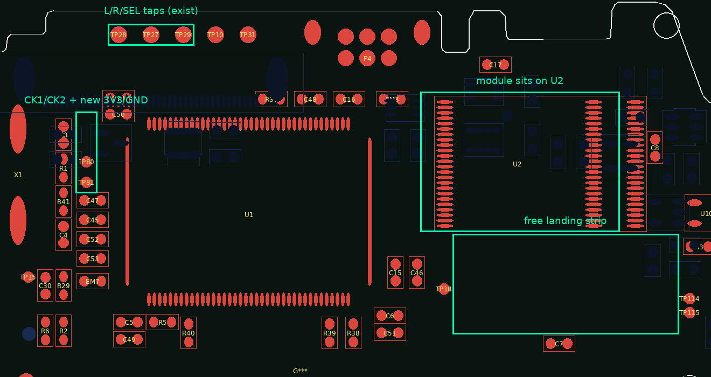
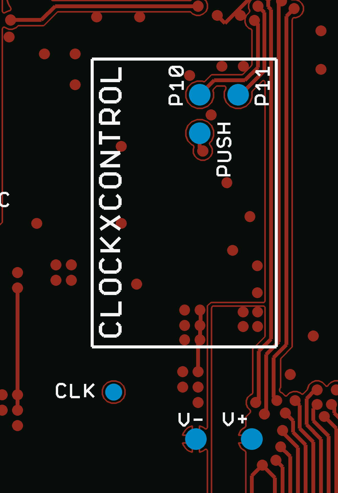
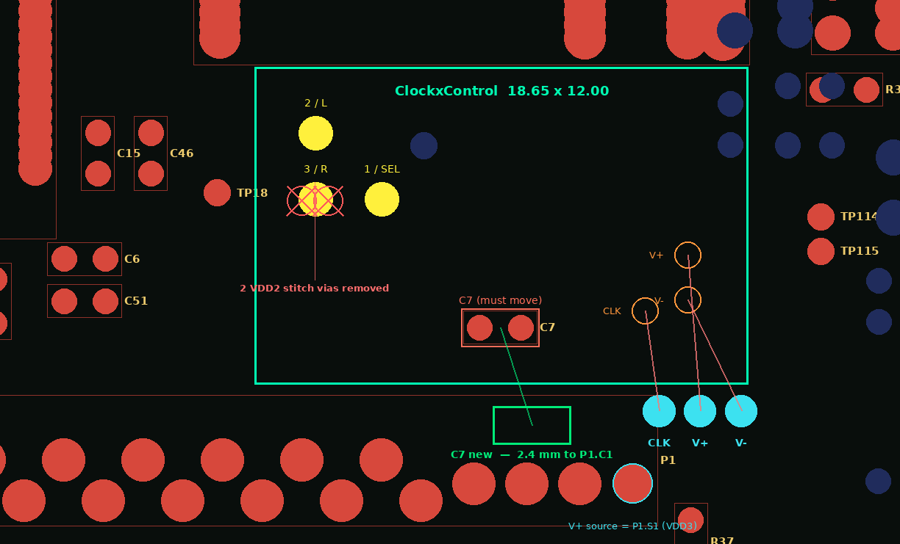
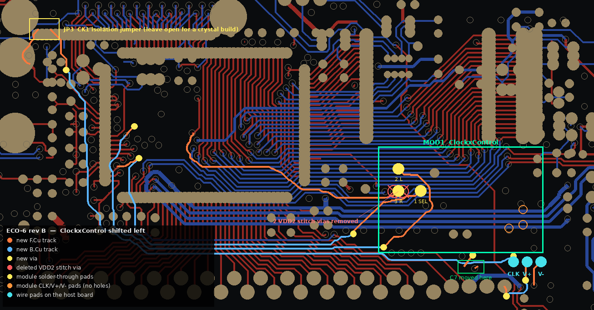
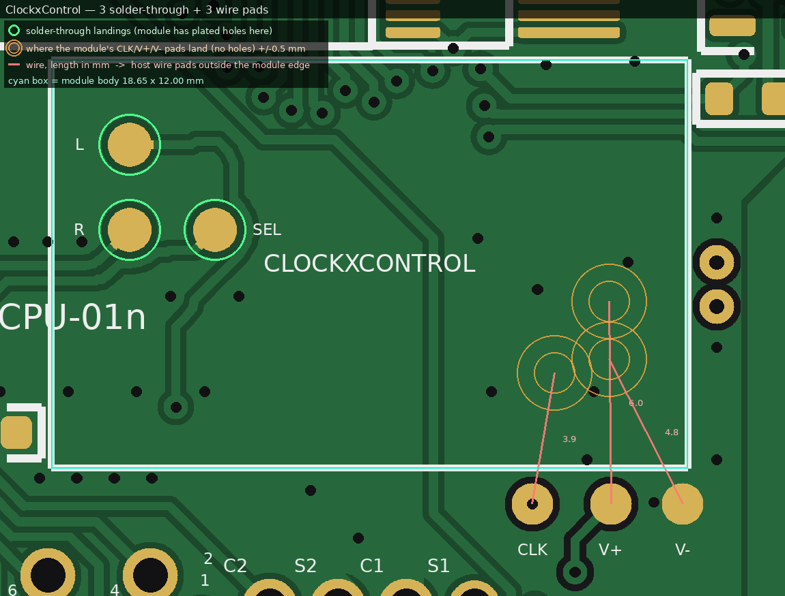
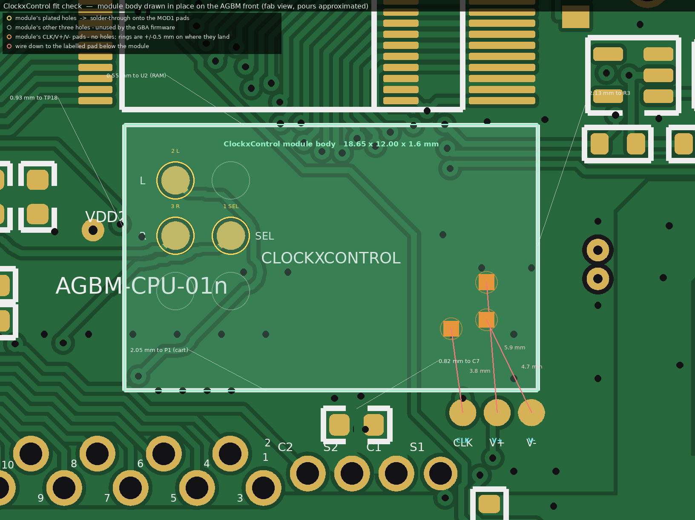

# ClockxControl integration on the AGBM — feasibility study

Can the MouseBiteLabs **Game Boy Enhance (AGBM)** carry a footprint for insideGadgets'
**GBA ClockxControl**, and drop the stock 4.194304 MHz crystal that the mod requires be removed?

**Status: analysed, and cut into the board.** The land pattern is placed, wired and
clearance-verified on this fork's `_GBE-plus` board — see
[ECO-6](ECO-6_clockxcontrol_footprint.md) and [`board/agbm-01-clockxcontrol.zip`](board/agbm-01-clockxcontrol.zip).
It has not been through KiCad's own DRC, and the shell fit is unverified; read ECO-6 §6.7 before
fabbing. Board numbers are taken from the design files in this repository (KiCad 9 `.kicad_pcb` for
AGBM-01 rev 1.2b, AGBM-02 rev 1.1, AGBM-11 rev 1.3). The ClockxControl land pattern is taken
from **MouseBiteLabs' own DMGC-CPU-01 rev 2.5 gerbers** (Game Boy DMG Color), whose v2.5
release note reads *"Added space for adding ClockxControl by insideGadgets"* — the first known
host-side footprint for this module. Anything inferred rather than measured is flagged.

---

## Short answer

| Question | Answer |
|---|---|
| A real solder-down footprint the module mounts onto? | **Yes, for the three button pads.** Those are plated through-holes: the module lies flat and is fixed by dropping solder through the hole onto the pad below. MouseBiteLabs already ships this on the DMG Color CPU board. |
| And CLK / V+ / V−? | **Wires — the module has no holes there**, they are plain top-side pads. So those three get labelled wire pads immediately outside the module body: **3.9, 6.0 and 4.8 mm** of wire, against 40–60 mm on a stock install. |
| Does the AGBM have room for it? | **Yes, once one 0603 moves.** Relocating `C7` opens an 18.65 × 12.00 mm component-free window on the front side directly below the RAM, clear of every mechanical keepout. Done in ECO-6. |
| Delete the crystal because the mod requires removing it? | **Yes, but as a DNP build option, not a deletion.** Keep X1/C3/C4 on the board, unpopulated for ClockxControl builds. |

A KiCad footprint built from the extracted geometry is in
[`footprint/ClockxControl_GBA_GBC.kicad_mod`](footprint/ClockxControl_GBA_GBC.kicad_mod), and the
modified board is in [`board/`](board/).

The engineering record, in order:

| | What |
|---|---|
| [ECO-6](ECO-6_clockxcontrol_footprint.md) | the land pattern, the `C7` relocation, the wire pads, `JP3`, and the rev B shift west |
| [ECO-7](ECO-7_u2_supply_and_dnp.md) | `X1`/`C3`/`C4` marked DNP; the `U2` pin-37 and `Net-(Q5B-G)` blockers, and why the review's fix for them must not be applied |
| [ECO-8](ECO-8_component_swaps.md) | thirteen part swaps from the [power review](../power-review/README.md) — `U7` off a rail it is not specified for, `PTC1` off a hold current it is under, and ~26 mW |
| [ECO-9](ECO-9_assembly_split.md) | make the board say what a pick-and-place can actually buy and place — it was asking for the salvaged CPU |

---

## 1. What the ClockxControl needs

From insideGadgets' own **Installation (GBA)** tab, quoted verbatim:

> 1. Use a hot air gun to de-solder the existing crystal. Be careful not to remove any of the near by components.
> 2. Place the device as shown with some double sided tape or a little bit of blu-tack to insulate it from the GBA board and use the wiring below.
>
> Device V+ to GBA SI
> Device V- to GBA GND
> Device CLK to GBA CK1
> Device 1 to GBA TP2 (Select) or TP3 (Start)
> Device 2 to GBA TP9 (L trigger)
> Device 3 to GBA TP8 (R trigger)

Six connections. Module is **18 × 12 × 1.6 mm** published; MouseBiteLabs drew it as
**18.65 × 12.00**. It draws ~12 mA of its own plus 40–60 mA more when the console is actually
overclocked. GBA firmware offers 0.333x / 0.5x / 0.666x / 1x / 1.25x / 1.5x / 1.75x, selected by
holding **Select** and tapping **L** or **R**; hold Select for 2 s to return to 1x.

### "GBA SI" is a typo for the pad silkscreened **S1**, and S1 is the 3.3 V rail

This matters, because "SI" reads as the link-port serial-in line, which would be a nonsense place
to draw 12 mA. It isn't that. In insideGadgets' own install photo the red V+ wire lands on the
pad silkscreened **`S1`**, in the `C2 S2 C1 S1` group at the right-hand end of the cartridge
connector's solder row. On the AGBM that pad is `P1` pad `S1`, and it is on net **`VDD3`** — the
switched 3.3 V logic rail — on **all three board variants**:

```
P1 (CART SLOT) pad S1  ->  VDD3     (AGBM-01, AGBM-02, AGBM-11: identical)
P1             pad C1  ->  VDD35
P1             pad S2  ->  VDD5
P1             pad C2  ->  /CPU/IN35
```

So: **V+ = VDD3**, gated by `U18` (TPS22917) off `VOUT3`, so the module powers down with the
console — no standby drain. Same behaviour as a stock GBA.

---

## 2. Where each signal already lives on the AGBM

All coordinates are KiCad board coordinates in mm, front side (`F.Cu`) unless noted.
The oscillator corner (`X1`, `C3`, `C4`, `R1`, `R41`, `TP80`, `TP81`) and the `L`/`R`/`SEL` tap row
are **identical across AGBM-01, AGBM-02 and AGBM-11** — same coordinates, same nets — so one ECO
covers all three. Only the power test points differ: `TP21` is `VDD3` on AGBM-01/-02 but `VUSB` on
AGBM-11, where the `VDD3` test point is `TP16` (F.Cu, 32.30, −34.20) and a lone `GND` test point
`TP25` sits at 9.80, −12.40. None of those are near the clock corner on any variant.

| CXC pin | AGBM net | Already exposed at | Coordinates |
|---|---|---|---|
| `CLK` | `/CPU/CK1` | **`TP80`** (silkscreen `CK1`) | 48.00, −58.00 |
| `1` (Select) | `/CPU/TP2` | **`TP29`** (silkscreen `SEL`), also `TP2` | 57.00, −69.80 |
| `2` (L) | `/CPU/TP9` | **`TP28`** (silkscreen `L`), also `TP9` | 51.00, −69.80 |
| `3` (R) | `/CPU/TP8` | **`TP27`** (silkscreen `R`), also `TP8` | 54.00, −69.80 |
| `V+` | `VDD3` | **`P1` pad `S1`** — the same pad the stock instructions use | 96.90, −35.20 |
| `V-` | `GND` | *no GND test point at all* on AGBM-01/-02 | — |

Four of six signals already have labelled front-side pads, three of them (`L`, `R`, `SEL`) grouped
in one row at 3 mm pitch that MouseBiteLabs put there for the hotkey/touch-control mods, and V+ is
the cart connector's `S1` pad. Only GND has nothing convenient.



---

## 3. The crystal circuit, and what happens when you dump it

Straight out of the board file — `U1` is the AGB CPU, pins 113/114 are XIN/XOUT:

```
U1.113 (CK1) ──┬── R1 1.5M ──┬── U1.114 (CK2) ── R41 2.2k ──┬── X1 pad 2
               │             │                              └── C4 33p ── GND
               ├── C3 27p ── GND                             (net: Net-(C4-Pad1))
               ├── X1 pad 1  (4.194304 MHz, HC-49)
               └── TP80 (test point "CK1")            TP81 sits on CK2
```

Nothing else on the board touches `CK1` or `CK2` — no second consumer, no buffer, no divider.
The whole system clock is derived inside the CPU. So substituting an external driver is a
one-node change.

**For a ClockxControl build:**

- **`X1` — do not populate.** This is the mod's own requirement.
- **`C3` (27 p) — do not populate.** It is the XIN load cap; with the crystal gone it is just
  27 pF hung on the module's output. Harmless if left (≈0.37 mA of extra drive current at
  4.19 MHz, more when overclocked) but there is no reason to keep it.
- **`C4` (33 p) — do not populate.** An earlier revision of this document said C4 is "dangling
  once the crystal is gone." **That was wrong**, and the netlist says so plainly: `X1` pad 2, `C4`
  pad 1 and `R41` pad 2 all sit on `Net-(C4-Pad1)`, so removing `X1` leaves C4 tied to `CK2`
  through `R41`. It is not dangling, it is 33 pF still hanging on the CPU's XOUT node through
  2.2 kΩ. That makes the case for depopulating it stronger, not weaker.
- **`R41` (2.2 k) and `R1` (1.5 M) — may stay.** `R41` is the XOUT drive-limiting resistor; with
  `X1` and `C4` both off it ends up driving nothing. `R1` is the 1.5 M bias resistor; leaving it couples the externally
  driven CK1 to the CPU's own (now unloaded) inverter output through 1.5 MΩ, which is nothing.
  insideGadgets' stock-GBA instructions only say to remove the crystal, so the caps and resistors
  staying in place is the field-proven configuration anyway.

**`X1`, `C3` and `C4` are marked DNP on the board** as of ECO-7, so an assembly house will leave
them off without needing a separate build note. That was a real gap: before ECO-7 the three parts
shipped as ordinary fitted components.

**Keep the footprints.** Deleting X1/C3/C4 from the design would mean the board cannot boot
without a $23 add-on installed, would diverge from upstream for every builder who does not want
the mod, and would remove the fallback if the module ever fails. A DNP line in the BOM plus a
build note gets you everything and costs nothing — the same pattern ECO-5 used for `JP2`.

---

## 4. The land pattern, extracted from DMGC-CPU-01 rev 2.5

MouseBiteLabs' Game Boy DMG Color CPU board carries a `CLOCKXCONTROL` silkscreen outline on its
**bottom** side with three solder-through landing pads inside it. That is the reference design;
everything in this section is measured out of `DMGC-CPU-01_2-5` gerbers, not estimated.



### How the module mounts

The module's I/O pads are **plated through-holes**. It sits flat on the host board over the
landing pads and is fixed by dropping solder into the hole from above, which wets down onto the
host pad and binds the two boards. No castellations needed, no wires for those signals. The host
pads are **plain SMD pads — the DMG Color board has no drill hits at any of them** (checked against
`drill_1_16.xln`), so this costs the host board nothing but copper.

### Body outline

```
silkscreen rectangle, bottom silk, 0.2 mm line
   (46.000, 49.500)  to  (58.000, 68.150)
   =  12.000 mm across  x  18.650 mm along
```

### Landing pads

Three pads, all identical: **ø1.270 mm copper, ø1.397 mm mask opening** (0.0635 mm mask expansion
per side), no drill.

| Board ref | Absolute (mm) | From the pad-end edge | From the reference long edge |
|---|---|---|---|
| `P11` | 48.500, 65.850 | 2.300 | 2.500 |
| `P10` | 51.000, 65.850 | 2.300 | 5.000 |
| `PSH_IN` | 51.000, 63.350 | 4.800 | 5.000 |

So the module's pad field is a **2.5 mm lattice**: two columns 2.300 and 4.800 mm in from the end,
three rows 2.500 / 5.000 / 7.500 mm in from one long edge. Six pads; the GBA/GBC firmware uses
three of them, and the three used sites form an L.

### Cross-check against insideGadgets' own install photo

Independent confirmation, and it also resolves the mirror ambiguity (the DMG Color mounts the
module on the *bottom*; the AGBM would mount it on the *front*). In insideGadgets' GBA install
photo the three wires land on the middle row left, middle row right, and bottom row right — the
same L. It matches the DMG Color's set exactly once the short axis is flipped, which is precisely
the front-vs-back mirror. Two independent sources, same three sites.

### Which site is which signal

Inferred, not measured. insideGadgets' GBC wiring list says *Device 2 → P11, Device 3 → P10,
Device 1 → P12*; MouseBiteLabs wired `P11` and `P10` to two of the sites and substituted his
board's `PSH_IN` for the third. Reading those together:

| Module pad | Site (from end, from reference edge) | GBA function |
|---|---|---|
| `1` | 4.800, 5.000 | **Select** |
| `2` | 2.300, 2.500 | **L** |
| `3` | 2.300, 5.000 | **R** |

**Confirm this with a continuity check on a physical module before committing to fab.** It is one
beep per pad and it is the only assumption in the whole land pattern. If it turns out reversed, the
fix is swapping which AGBM net feeds which pad — the geometry does not change.

### What is *not* solder-through

`CLK`, `V+` and `V-` sit at the module's other end and MouseBiteLabs did **not** land them — on the
DMG Color they are ordinary wire pads placed just outside the outline (`CLK` at 56.60, 46.55;
`V-` at 47.61, 43.50; `V+` at 51.25, 43.50). Their positions on the module have not been
published or measured, so this study keeps them as wire pads too. Measure a unit and all six could
be landed.

---

## 5. Where it goes on the AGBM

The module lies flat, so it still needs a **component-free** area of 18.65 × 12 mm — floating over
tented vias and traces is fine (the DMG Color footprint sits over a via field), but not over
components. Two constraints narrow this hard:

- **The back is out.** MouseBiteLabs defined a rule area on `B.Cu`, `x 33.1…105.1, y −54.2…−32.2`
  (72 × 22 mm), `pads: not_allowed, footprints: not_allowed` — the game pak sits there. That is
  the reason the back looks empty behind the CPU. Tracks and vias *are* allowed through it, which
  matters for routing (below).
- **The front has no free 18.65 × 12 window as drawn** — verified by rasterising the outline,
  every front-side courtyard and every mechanical keepout, then searching all placements.

But it is one part away. Ranking every legal placement by how many footprints it collides with:

| Placement (x, y) | Blocked by |
|---|---|
| **82.3…100.9, −50.8…−38.8** | **`C7` only** |
| 50.8…69.4, −61.3…−49.3 | `U1` (i.e. on top of the CPU) |
| 75.3…93.9, −62.8…−50.8 | `U2` (i.e. on top of the RAM — the stock taped position) |
| 82.3…100.9, −45.3…−33.3 | `C7`, `P1` |

The winner is the gap between the RAM and the cartridge connector, and the only thing in it is
`C7` — a 0603 0.1 µF from `VDD35` to `GND`, one of three cart-rail bypass caps (`C6`, `C51`, `C7`).
Moving it clears the window; ECO-6 puts it south of the module, closer to the cart's `VDD35` pin
than MouseBiteLabs had it. The same window and the same single
blocker appear on **AGBM-01, AGBM-02 and AGBM-11**. On this fork's `_GBE-plus` board the ECO-5
fiducial `FID2` (88.5…89.5, −48.5…−47.5) also lands inside and would need nudging.



### As built in ECO-6

The window has ~2.5 mm of horizontal and 0.65 mm of vertical slack, and the copper inside it is
dense (the `U2` escape fan plus `VDD2`/`GND`/`VDD5` stitching rows), so where the footprint sits
inside the window is a trade: pad-to-copper clearance is best at the east end of the window, body
clearance to the neighbouring parts is best at the west end. ECO-6 rev B lands in the middle at
**centre (91.950, −44.950), rot 180** — 0.550 mm worst body clearance and 0.240 mm minimum
pad-to-copper, both over the 0.2 mm requirement — with the button end facing west toward the nets
it needs. Getting there costs two `VDD2` plane-stitching vias that the `R` landing now sits on;
[ECO-6 §6.7](ECO-6_clockxcontrol_footprint.md) is the full accounting.

| Pad | Net | Absolute position |
|---|---|---|
| `1` — Select | `/CPU/TP2` | 87.425, −45.950 |
| `2` — L | `/CPU/TP9` | 84.925, −48.450 |
| `3` — R | `/CPU/TP8` | 84.925, −45.950 |
| `TP83` — CLK wire pad | `CXC_CLK` (new net) | 97.900, −37.950 — 3.8 mm of wire |
| `TP84` — V+ wire pad | `VDD3` | 99.450, −37.950 — 5.9 mm of wire |
| `TP85` — V− wire pad | `GND` | 101.000, −37.950 — 4.7 mm of wire |

The first three are solder-through, on measured geometry from a shipping board. The last three
have to be wires: **on the module, `CLK`, `V+` and `V-` are plain top-side pads with no hole**, so
there is nothing to solder into. They sit in the clear pocket immediately south of the module body,
left-to-right in the same order as the module's own pads so the wires do not cross. Where those
module pads land is photo-derived to ±0.5 mm, but that now only changes wire length — nothing has
to be re-measured before a fab run.

`JP3`, a default-open solder jumper 6.9 mm from `TP80`, gates the 73.5 mm CLK run so a board built
with the crystal never sees that stub on its oscillator node. Bridge it only when populating the
module.

`C7` moves to **(93.100, −37.400)**, in the band between the module and the cartridge connector,
with a 0.4 mm stub onto the `VDD35` stitch via next to it and a stub-and-via down to the ground
planes. That lands its `VDD35` pad **2.4 mm from `P1` pad `C1`**, the cart's `VDD35` pin — closer
than the 6.3 mm it had on the stock board. The ECO-5 fiducial pair `FID2`/`FID5` moves to
(106.250, −57.250) — which incidentally fixes three pre-existing shorts, see ECO-6 §6.4.

The layout: three solder-through landings (yellow), the module’s hole-less CLK/V+/V− pads (orange
rings) wired down to the three wire pads (cyan), `C7` in its new home, the two `VDD2` stitching
vias that had to go, `JP3` and the routing:



And the same area as a fab preview — green rings are the solder-through landings, orange rings show
where the module's hole-less CLK/V+/V− pads land (±0.5 mm), and the red lines are the three wires
to the pads below. `render/fab_landings_1to1_600dpi.png` is the same view at 1:1 for printing and
laying a real module on:



And the fit check with the module body drawn in place — its three plated holes over the `MOD1`
landings, its three hole-less pads ringed at ±0.5 mm with their wires, and the gap to every
neighbour:



**Copper from CK1 to the module must be gated.** An ungated run would hang ~5 pF and 75 mm of
antenna on the oscillator's high-impedance XIN node for every board built the normal way with the
crystal fitted. `JP3` (default open) disconnects it, leaving 5 mm of stub — so a crystal build is
electrically identical to the board without this ECO. Same default-open pattern ECO-5 used for
`JP2`.

### Routing the three button nets

`TP2`, `TP8` and `TP9` originate around x 51…57 near the CPU, so each pad needs a 26–36 mm run.
They are slow, already-filtered button lines (15 Ω series plus 0.01 µF on TP8/TP9), so length is
irrelevant electrically. ECO-6 routes all three — and with the CLK, V+ and V− pads and the `C7` ties added, the board
carries **225.5 mm of new track and 9 new vias** in total (and drops 2), with the B.Cu portions
running through the cartridge keepout, which explicitly permits tracks and vias.

---

## 6. Compatibility notes and risks

**Hotkey combos partially overlap.** The AGBM's own hotkey logic is discrete, not firmware:
`U15` (SN74LVC1G332, 3-input OR) takes Start (`TP3`), R (`TP8`) and L (`TP9`) and produces
`/CPU/LRST`; `U16` (SN74HC02 quad NOR) then gates `LRST` against Select (`TP2`), A (`TP0`),
B (`TP1`) and a D-pad line (`TP6`) to drive the reset and touch-control FETs. So AGBM hotkeys are
**Start + L + R + one of {Select, A, B, D-pad}**, while ClockxControl is **Select + L/R**. They do
not collide in normal use, but holding Select + L + R and then pressing Start will drive both.
Worth a line in a build sheet.

**The module taps the same button nets the AGBM's own logic uses.** `TP2`/`TP8`/`TP9` already
carry 15 Ω series resistors and 0.01 µF caps (`R43`/`R44`, `C63`/`C64`/`C78`) plus the OR-gate
inputs. Adding a high-impedance monitor is fine; do not expect to *drive* those nets.

**Power.** +12 mA continuous on `VDD3`, +40–60 mA when actually overclocked. At 3.3 V that is
roughly 40 mW idle and up to ~200 mW overclocked. The AGBM's headline efficiency claim is ~150 mW
less draw than a Funnyplaying GBA — so running overclocked spends that advantage and then some.
Battery-life figures in the AGBM READMEs do not apply to an overclocked build.

**Screens and carts** (insideGadgets' own caveats): works with the FP IPS kit; the FunnyPlaying
laminated IPS is reported good to 1.25x and fades to black at 1.5x; the OneChip IPS is reported
glitchy. GBA flash carts crash above 1x; genuine carts are generally fine; 1.75x is the ceiling.

**Underclocking and the AGBM's audio chain — untested, flagged.** The GBA's PWM audio carrier
scales with the system clock, and MouseBiteLabs put real work into the AGBM's analogue
reconstruction path (`U7` TLV9364 and friends), tuned around stock timing. At 0.5x and especially
0.333x the carrier drops toward the audio band. Expect artefacts, possibly different from what a
stock GBA does. This is reasoning from the topology, not a measurement.

**No crystal means no clock.** With `X1` unpopulated the console will not boot without the module
fitted and working. Obvious, but it makes the module a single point of failure and makes bring-up
testing harder. Building the board with the crystal, testing per the wiki, then removing
`X1`/`C3`/`C4` is the safer order.

**Overclocking and the RAM — the desalvage part is the *better* one here.** At 1.75x the system
clock is ~29.4 MHz, so a 3-cycle 16-bit EWRAM access shortens from ~179 ns to ~102 ns. The
CY62157EV30LL-45Z from ECO-5 still has better than 2x margin at that speed. A salvaged original
GBA WRAM has less headroom. If this fork ends up carrying both mods, that is a point in the
de-salvaged board's favour, not against it.

---

## 7. Open items

1. **Continuity-check a physical module** to confirm which of the three lattice sites is Device
   pad 1, 2 and 3 (§4). One beep per pad; it is the only assumption in the land pattern.
2. **Measure the CLK / V+ / V- trio** at the module's other end if you want all six solder-through
   instead of three plus three wires. MouseBiteLabs did not, and the three-wire version is the
   shipping precedent.
3. **Confirm the 18.65 mm length.** insideGadgets publish 18 mm; MouseBiteLabs drew 18.65. The
   footprint here uses his number, which is the conservative one for a keep-out.
4. **Shell / screen clearance over the new window.** The area is outside every mechanical keepout
   MouseBiteLabs defined, and a module lying directly on the board (1.6 mm) sits *lower* than the
   stock install (1.6 mm of module on top of ~1.2 mm of RAM), which is field-proven in a GBA shell
   with an FP IPS kit. That is good evidence but not a measurement — check it with a shell and
   calipers, as with ECO-5's fit item.
5. **KiCad DRC and a re-pour** on the modified board, and symbols for `MOD1`, `JP3` and
   `TP83`/`TP84`/`TP85` if the board is ever updated from a schematic. Full list in
   [ECO-6 §6.8](ECO-6_clockxcontrol_footprint.md).
6. **The two deleted `VDD2` stitching vias.** They are pure plane stitching in a lobe of pour that
   carries no `VDD2` pads, and the lobe keeps two full-stack ties, but it is a deletion from the
   host design — [ECO-6 §6.7](ECO-6_clockxcontrol_footprint.md) sets out why there was no
   alternative and why it is harmless.

---

## Files

```
ECO-6_clockxcontrol_footprint.md              engineering record for the board edit
board/agbm-01-clockxcontrol.zip               the modified board: AGBM-01_AA_1-2_GBE-plus-CXC.kicad_pcb
footprint/ClockxControl_GBA_GBC.kicad_mod     KiCad 9 land pattern built from the DMG Color geometry
render/agbm01_cxc_overview.png                AGBM-01 front, the signals involved
render/agbm01_cxc_placement.png               the window below the RAM, the C7 move and the deleted vias
render/agbm01_cxc_board_after6.png            copper diff: landings, wire pads, JP3 and the full routing
render/dmgc_cpu_01_2-5_cxc_footprint.png      MouseBiteLabs' own footprint, rendered from his gerbers
render/fab_front.png                          fab view, whole front side
render/fab_back.png                           fab view, whole back side (mirrored)
render/fab_landings.png                       fab view of the landings
render/fab_fit.png                            fit check: module body drawn in place, holes, wires, clearances
render/fab_landings_fit.png                   annotated: solder-through landings, wire pads and wire lengths
render/fab_landings_1to1_600dpi.png           1:1 scale print sheet - print at 100% and lay a module on it
```

## Sources

- insideGadgets, [GBA/GBC/DMG ClockxControl](https://shop.insidegadgets.com/product/gba-clockxcontrol/) — install wiring, dimensions, firmware speeds, current draw, screen/cart compatibility, and the install photos referenced in §1 and §4.
- MouseBiteLabs, [Game Boy DMG Color](https://github.com/MouseBiteLabs/Game-Boy-DMG-Color) — `DMGC-CPU-01` rev 2.5, *"Added space for adding ClockxControl by insideGadgets"*. Land pattern in §4 extracted from that board's gerbers.
- MouseBiteLabs, [Game Boy Enhance wiki — Mod Compatibility](https://github.com/MouseBiteLabs/Game-Boy-Enhance/wiki/Mod-Compatibility) and [AGBM-01 (AA) Build/Test Order](https://github.com/MouseBiteLabs/Game-Boy-Enhance/wiki/AGBM-01-%28AA%29-Build-Test-Order).
- This repository: the AGBM-01 / -02 / -11 design-file archives, and `agbm-01-ram-desalvage.zip` (ECO-5).

## License & attribution

Derivative analysis of the **MouseBiteLabs Game Boy Enhance (AGBM)** and **Game Boy DMG Color**,
both licensed **CC BY-SA 4.0**. This document, the renderings in `render/`, and the footprint in
`footprint/` are released under the same licence. The ClockxControl is a product of insideGadgets;
no part of their design is reproduced here — the land pattern is the *host-side* pattern published
by MouseBiteLabs under CC BY-SA.
